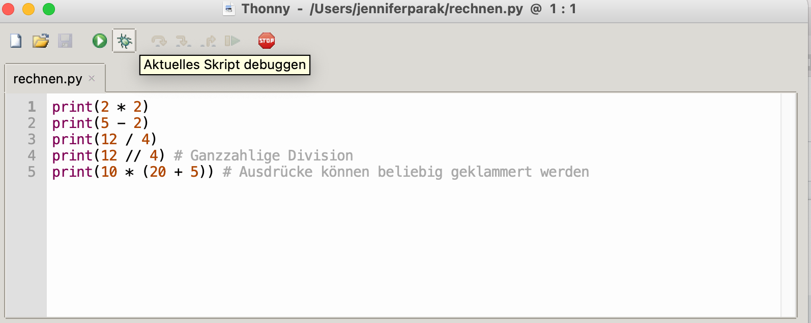
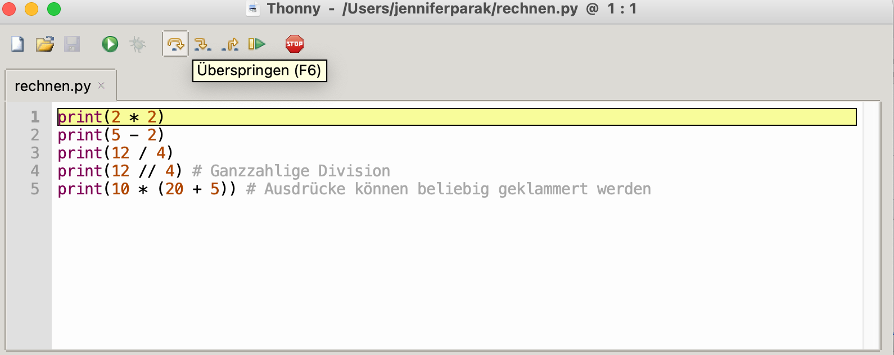

Baustein 1 Meeting 1
====================

Hello World, Datentypen, Variablen, Verzweigungen und Schleifen

*   [1\. Hello World](#1-hello-world)
*   [2\. Datentypen](#2-datentypen)
*   [3\. Variablen](#3-variablen)
*   [4\. Basisoperationen](#4-basisoperationen)
    *   [4.1. Übung: Einkauf](#41-bung-einkauf)
*   [5\. Flusskontrolle](#5-flusskontrolle)
*   [6\. Schleifen](#6-schleifen)
*   [7\. Kommentare](#7-kommentare)
*   [8\. Endlos Katzen](#8-endlos-katzen)
*   [9\. Code](#9-code)

<br>

1 Hello World
-------------

Beim Lernen von Programmiersprachen ist es eine weit verbreitete Tradition, als Erstes ein Programm zu schreiben, welches einfach nur `hello world` ausgibt. Diese Tradition wollen wir natürlich nicht brechen, außer dass wir es auf die Hamburger Art machen.

```python
print("Moin world")
```

```
Moin world
```

🎉

Führt man diese Codezeile in Thonny aus, erscheint die Ausgabe in einem separaten Fenster namens "Shell". Die shell ist eine rein textuelle Benutzeroberfläche um mit dem Computer zu arbeiten: Der Computer kann hier Ausgaben reinschreiben, und auch der Nutzer kann Text eingeben (das lernen wir später kennen). In diesem Fenster werden wir also die Ausgaben unserer Programme sehen, d.h. alles was durch den `print`\-Befehl ausgegeben wird. Auch Fehlermeldungen erscheinen hier.

`print` ist eine Funktion, das bedeutet das der Print-Aufruf ein bestimmtes Verhalten auslöst. Funktionen werden wir später genauer kennen lernen, und wir werden auch eigene Funktionen schreiben.

Weiterhin ist `print` eine sogenannte Built-In Funktion, d.h. sie ist ein fester Bestandteil der Programmiersprache Python und ihr könnt jederzeit auf sie zugreifen. Sie gibt das Funktionsargument auf der Konsole ("Shell" in Thonny) aus. Es gibt [eine Vielzahl von built-in Funktionen](https://docs.python.org/3/library/functions.html), einige davon werden wir auch noch im Kurs kennenlernen.

<br>

2 Datentypen
------------

"Moin world" ist mit Gänsefüßchen abgetrennt. Das bedeutet, dass "Moin world" Daten in Form einer Zeichenkette ("string") sind. Daten können als Literale (dh. explizit in das python-programm reingeschrieben, wie in diesem Fall) vorliegen. Oder sie können aus Funktionsaufrufen erhalten oder importiert werden (dazu später mehr). Es gibt auch Daten in Form von Zahlen. Die Literale dazu sehen dann so aus:

```python
print(1)   # Das ist eine Ganzzahl, ein sog. Integer
print(1.2) # Das ist eine Kommazahl, ein sog. Float
```
```python
1
1.2
```

Es gibt noch ein paar weitere Datentypen in Python, die wir noch kennenlernen. Mit der built-in Funktion type kann man sich jederzeit den typ zu einem Literal ausgeben lassen.

```python
print(type(1))
print(type(1.2))
```
```python
<class 'int'>
<class 'float'>
```

(Tipp: In dem obigen code-block habe ich Funktionsaufrufe geschachtelt. Das kann man beliebig oft tun, geschachtelte Ausdrücke werden immer von innen nach aussen ausgewertet.)

<br>

3 Variablen
-----------

Variablen sind ein weiterer wichtiger Bestandteil von Python - Programmen. Sie sind Platzhalter. Zum Beispiel können sie eine Zeichenkette oder Zahl als Wert enthalten. Werte von Variablen können sich mit der Zeit ändern. Sie werden mit der Schreibweise platzhaltername = wert deklariert. Variablennamen dürfen Buchstaben, Unterstriche und Zahlen enthalten (vobei das erste Zeichen des Variablennamens keine Zahl sein darf).

```python
gruß = "Moin"
name = "World"

print(gruß)   # Aktueller wert ist 'Moin'
print(name)

gruß = "Hallo" # Wert des Platzhalters wird hier verändert

print(gruß) # Jetzt wird 'Hallo' ausgegeben
print(name)
```
```
Moin
World
Hallo
World
```

Variablen kann man genau so gut mit numerischen Literalen belegen.

```python
zahl = 42.0
print(zahl)
```
```python
42.0
```

Zahlen können auch von Zeichenketten überschrieben werden

```python
zahl = "Dies ist eine Zeichenkette"
print(zahl)
```
```python
Dies ist eine Zeichenkette
```

Pro-Tipp: Zeichenketten können auch mit dem einfachen Apostroph abgegrenzt werden.

```python
print('Wieder was gelernt')
```
```python
Wieder was gelernt
```

<br>

4 Basisoperationen
------------------

Zahlen und Zeichenketten im Program zu haben ist ja schön und gut, aber was können wir damit anstellen? Mit Zahlen können wir z.B. rechnen, in der üblichen Schreibweise.

```python
x = 10
y = 20

print(x + y)

z = x + y

print(z + 2)
print(2 * 2)
print(5 - 2)
print(12 / 4)
print(12 // 4) # Ganzzahlige Division
print(10 * (20 + 5)) # Ausdrücke können beliebig geklammert werden
```
```python
30
32
4
3
3.0
3
250
```

### Debugging

Hier ist es sehr hilfreich mit dem Debugger von Thonny zu arbeiten, dieser wird gestartet indem man auf den Käfer klickt:


Mit "Step into" (zweiter Pfeil neben dem Käfer) könnt ihr euch ganz genau ansehen, wie die einzelnen Befehle ausgewertet werden.


Schlussendlich, hier noch eine witzige Legende zur [Herkunft des Wortes "debugging"](https://de.wikipedia.org/wiki/Debugger#Namensherkunft)

### Mehr rechnen

Neben der Grundrechenarten gibt es noch ein paar weitere Operatoren.

"Modulo" gibt den Rest bei einer ganzzahligen Division. Um zu verstehen warum `13 % 5 == 3`, kann man das Beispiel vom Teilen von z.B. Keksen auf eine Gruppe Freunde vorstellen. Wenn ihr 13 Kekse auf 5 freunde fair aufteilen wollt (jeder bekommt die gleiche Anzahl, und man kann Kekse nicht weiter teilen), dann bekommt jeder 2 Kekse und 3 bleiben übrig. Die `3` ist der modulo💡.

```python
print(13 % 5) # Modulo
print(4 ** 4) # Potenz
```
```python
3
256
```

### Interessantes über Floating Points

Nun lasst uns mal über Floating Points (Fließkommazahlen) sprechen. 

```python
print(0.1 + 0.2)
```

```python
0.30000000000000004
```

Warum kommt bei `0.1 + 0.2` so ein krummes Ergebnis raus? Wie stellt der Computer "unendliche" Kommazahlen dar wie z.B. `1/3 = 0.333333.. `?
Auch wenn es gerade komisch erscheint, es ist wichtig dies im Gedächnis zu behalten.
Zum Beispiel die Zahl 0.1 kann nicht als binäre Zahl representiert werden und daher kommt es bei Fliesskommazahlen (0.1, 0.2, 0.3…) öfters zu kleinen Rundungsfehlern. 
Mehr dazu kann man in der [offiziellen Python Doku](https://docs.python.org/3/tutorial/floatingpoint.html) nachlesen, 
vorerst genügt es mal zu wissen, dass es zu Rundungsfehler kommen kann, für den Fall, dass ihr etwas mal ganz genau 
ausrechnen müsst. 

### Zeichenketten 

Zeichenketten unterstützen übrigens auch die Operationen `*` und `+`. Mit `+` lassen sich zwei Zeichenketten zusammenfügen, und `*` wiederholt eine Zeichenkette.

```python
name = "Jürgen"
print("moin " * 5 + name)
name = "Jürgen"
print("moin " + name)
```

```python
moin moin moin moin moin Jürgen
moin Jürgen
```

Funktioniert das `+` auch mit Zahlen und Zeichenketten? Probiert das mal aus:

```python
zahl = 42
zeichenkette = "72"
print(zahl + zeichenkette)
```


### 4.1 Übung: Einkauf

Angenommen ihr habt 10 Euro dabei und wollt damit eine Schokolade, einen Lolli und eine Achterbahnfahrt kaufen. Wieviel bleibt übrig? Beginnt damit Variablen für die einzelnen Preise zu deklarieren. Das Ergebnis soll auch einer Variable zugewiesen und dann ausgegeben werden.

|Produkt |Preis |
|--- | --- |
|Schokolade|1.5|
|Lolli|2|
|Achterbahn|1|

### Mögliche Lösung zur 4.1 Übung: Einkauf

```python
schokolade = 1.5
lolli = 1
achterbahn = 3

kosten = schokolade + lolli * 2 + achterbahn
r_geld = 10 - kosten

print("Kosten:", kosten, "Rückgeld:", r_geld)
```

```
Kosten: 6.5 Rückgeld: 3.5
```

5 Flusskontrolle
----------------

Häufig möchte man, dass sich ein Programm verschieden verhält je nachdem ob eine bestimmte Bedingung wahr ist, oder nicht. Eine Wahrheitsaussage wird in Python über einen besonderen Datentypen modelliert, den sogenannten 'Boolean' (benannt nach dem Mathematiker George Boole). Dieser Datentyp kann nur zwei Werte annehmen: True und False.

```python
print(type(True))
```

```python
<class 'bool'>
```

Eine if-Anweisung nimmt einen Wahrheitswert entgegen, und führt den darauffolgenden eingerückten Code-Block nur aus, wenn dieser Wert True ist.

```python
es_ist_heiss = True
if es_ist_heiss:
    print("Sonne")
```
```python
Sonne
```

In einer else - Anweisung kann der Codeblock angegeben werden, der alternativ ausgeführt werden soll.

```python
es_ist_heiss = True

if es_ist_heiss:
    print("Sonne")
else:
    print("Schnee")
```
```python
Sonne
```

Wahrheitswerte lassen sich auch aus Vorbedingungen berechnen. Zum Beispiel durch einen Zahlenvergleich. Angenommen, ihr möchtet in einem Programm eine Sonne anzeigen, wenn die Temperatur über 20 Grad ist. Ganz einfach:

```python
temperatur = 40
if temperatur <= 0:
    print ("Schnee")

if temperatur > 0 and temperatur < 20:
    print("Regen")

if temperatur >= 20:
    print("Sonne")
```

```python
Sonne
```

Es gibt noch weitere Operatoren zum Vergleichen von Zahlen: `<, <=, >, >=, !=` und `==`. Kleiner, kleiner gleich, größer, größer gleich ungleich und gleich. (Doppelt-gleich weil das einfache = für Variablenzuweisung belegt ist).

Mit der elif Anweisung können wir beliebig viele Bedingungen hintereinander prüfen. So lässt sich das Temperatur-Beispiel von eben viel einfacher aufschreiben.

```python
temperatur = 8
if temperatur < 10:
    print("Temperatur ist kleiner als 10")
elif temperatur < 20:
    print("Temperatur ist kleiner als 20")
else:
    print("Temperatur ist größer oder gleich 20")
```
```python
Temperatur ist kleiner als 10
```

Mit or und and können wir Bedingungen auch verknüpfen:
```python
if sonne_scheint and is_sunday:
    print("It's an awesome day")
```

Solche Ausdrücke werden folgendermaßen ausgewertet:

|a |b | a and b | a or b | 
|--- | --- |--- |--- |
|True|True|True|True|
|True|False|False|True|
|False|True|False|True|
|False|False|False|False|

### 5.1 Übung zur Flusskontrolle
Schreibe ein Programm um zu entscheiden ob wir rausgehen wollen oder nicht. 
Gegeben von 2 Boolean Variablen, gib den Text “rausgehen” oder “nicht rausgehen” aus.
wind: `False`
regen: `True`

Programmiere das folgende Szenario:
Bei wind oder regen → “rausgehen”
Bei wind und regen → “nicht rausgehen”
Ansonsten “rausgehen”

### Mögliche Lösung zu 5.2 Übung zur Flusskontrolle

```python
wind=False
regen=True

if wind or regen:
    print("rausgehen")
elif wind and regen:
    print("nicht rausgehen")
else:
    print("rausgehen")
```

### 5.2 Übung zur Flusskontrolle
Versuch die folgende Aufgabe zu programmieren:
Gegeben einer Variable `summe`, welche die Summe eines Einkaufs einer Person darstellt.
Wenn die `summe` größer gleich 1000 ist, dann ziehe 10% discount von der `summe` ab.
Wenn die `summe` größer gleich 500 und kleiner gleich 1000 ist, dann ziehe 5% discount ab.
Liegt die `summe` unter 500 ziehe keinen discount ab.
Gib den Wert der `summe` am Ende deines Programmes aus.

Nun teste dein Programm indem du die summe mit den folgenden Werten gleichsetzt:
- 2000
- 1000
- 505
- 500
- 499

### Mögliche Lösung zu 5.1 Übung zur Flusskontrolle

```python
summe=1000
if summe >= 1000:
    summe-=summe*(10/100)
    print(summe)
elif summe >= 500 and summe > 1000:
    summe-=summe*(5/100)
    print(summe)
else:
   print(summe)
```

```python
900
```

<br> 

6 Schleifen
-----------

Schleifen sind immer nützlich, wenn ihr Dinge wiederholt tun wollt. Zum Beispiel wäre es ziemlich nervig eine Codezeile für jeden User zu schreiben, dem ihr eine E-Mail schicken wollt. Mit Schleifen ist sowas aber kein Problem. while- Schleifen führen einen Codeblock aus, solange eine Bedingung wahr ist.

```python
i = 1
while i <= 10: # während i kleiner ist als 10
    i += 1 # erhöht i um 1. Kurzschreibweise für i = i + 1
    print(i)
```

```
2
3
4
5
6
7
8
9
10
11
```

```python
b = 1
while b <= 10:
    print(b)
    b += 2
```

```
1
3
5
7
9
```

Der Ablauf einer Schleife wird [in dieser Animation](https://goo.gl/images/sdRMLZ) ganz anschaulich dargestellt.

Schleifen umspannen beliebige Code-Blöcke, zum Beispiel kann eine Schleife wieder eine Schleife oder eine If-Else Anweisung enthalten.

```python
a = 1
while a < 7:
    if a % 2 == 0:
        print(a, "ist gerade")
    else:
        print(a, "ist ungerade")
    a += 1
```
```
1 ist ungerade
2 ist gerade
3 ist ungerade
4 ist gerade
5 ist ungerade
6 ist gerade
```

Auch diese Schleife gibt es [als Animation.](https://goo.gl/images/bE3Mpq) Der Thonny Debugger kann auch besonders bei solchen komplizierten Konstrukten hilfreich sein.

<br> 

7 Kommentare
------------

Alles hinter einem `#` wird von python ignoriert, so können wir Kommentare schreiben um Nachrichten an unser Zukunfts-Ich zu senden (uns Sachen zu merken)

```python
print("Moin world") # Dieser Funktionsaufruf gibt Text auf der Konsole aus.
```
```
Moin world
```

<br> 

8 Endlos Katzen
----------

Es soll eine Schleife programmiert werden, die eine Animation anzeigt. Dafür habe ich eine .gif Animation bereitgestellt, sowie eine Funktion `show(i)`, welche das Bild mit der Sequenznummer i anzeigt. Die Sequenznummern gehen von 0 bis 12. Ladet euch die nötigen Dateien herunter ([hier klicken](https://github.com/falcowinkler/falcowinkler.github.io/raw/master/resources/python-course/uebung_for_loop.zip)), entpackt das Archiv und löst die aufgabe dann in der Datei `uebung.py`. Weitere Instruktionen sind in der Datei in Kommentaren beschrieben.

So oder so ähnlich sieht euer Endergebnis aus:


Figure 1: Katzenanimation mit einer for-schleife

<br> 

9 Code
------

Den Code für dieses Meeting könnt ihr euch hier herunterladen: [**klick**](https://github.com/falcowinkler/falcowinkler.github.io/raw/master/resources/python-course/python_beginner_1.zip)